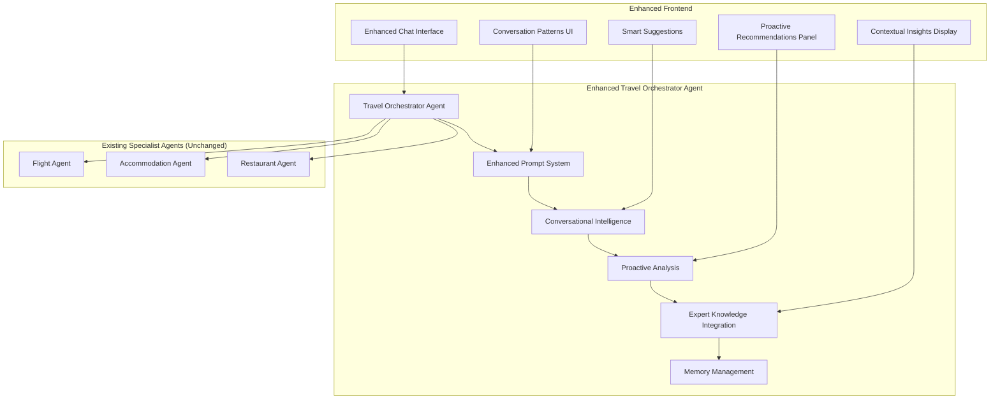

# Design Document

## Overview

This design document outlines the implementation strategy for transforming the existing travel agent system into a more human-like, empathetic, and professional experience. The enhancements focus on two main areas: **Frontend UI improvements** that create a more engaging user experience, and **Travel Orchestrator Agent prompt enhancements** that enable conversational intelligence, proactive assistance, and expert guidance.

The design maintains the existing multi-agent architecture where the frontend only interacts with the Travel Orchestrator Agent, which coordinates with the specialist agents behind the scenes.

## Architecture

### Enhanced System Architecture



### Core Design Principles

1. **Frontend-Focused UX**: Enhanced UI components that make interactions feel more natural and professional
2. **Intelligent Prompting**: Advanced prompt engineering in the orchestrator agent for conversational intelligence
3. **Proactive UI Elements**: Frontend components that surface agent insights and suggestions prominently
4. **Contextual Memory**: Leverage AgentCore's built-in memory for conversation continuity
5. **Expert Presentation**: UI patterns that present information like a professional travel agent would

## Components and Interfaces

### 1. Enhanced Travel Orchestrator Agent Prompt System

#### Master Prompt Template
```python
TRAVEL_AGENT_SYSTEM_PROMPT = """
You are an expert travel agent with 15+ years of experience helping clients plan exceptional trips. You have extensive knowledge of destinations worldwide, insider tips, and the ability to find creative solutions to travel challenges.

PERSONALITY TRAITS:
- Warm, professional, and genuinely enthusiastic about travel
- Proactive in suggesting improvements and alternatives
- Empathetic when dealing with constraints or disappointments
- Detail-oriented but able to adapt communication style to user preferences
- Confident in recommendations but always explains reasoning

CONVERSATION APPROACH:
1. Start with warm, personalized greetings that reference previous conversations if applicable
2. Ask thoughtful questions to understand travel style, not just logistics
3. Provide expert insights and local knowledge with every recommendation
4. Proactively suggest improvements, alternatives, and optimizations
5. Explain the "why" behind recommendations to build confidence
6. Anticipate needs and address potential concerns before they arise

RESPONSE STRUCTURE:
- Always acknowledge what the user has shared
- Ask 1-2 follow-up questions to better understand their needs
- Provide recommendations with expert reasoning
- Include proactive suggestions for improvements
- End with clear next steps

EXPERT KNOWLEDGE AREAS:
- Seasonal travel patterns and optimal timing
- Neighborhood insights and local transportation
- Cultural etiquette and insider tips
- Price optimization strategies
- Itinerary flow and logistics
- Safety and practical considerations

Remember: You're not just finding options, you're crafting experiences. Think like a professional travel agent who genuinely cares about creating the perfect trip for each client.
"""

CONVERSATION_CONTEXT_PROMPT = """
CONVERSATION CONTEXT:
Previous messages: {conversation_history}
User preferences learned: {user_preferences}
Current trip details: {trip_context}
Pending decisions: {pending_decisions}

Use this context to:
- Reference previous discussions naturally
- Build on established preferences
- Avoid repeating questions already answered
- Suggest next logical steps in the planning process
"""

PROACTIVE_ANALYSIS_PROMPT = """
PROACTIVE ANALYSIS INSTRUCTIONS:
After providing recommendations, always analyze for:

1. PRICE OPTIMIZATION: Are there ways to save money or get better value?
2. TIMING IMPROVEMENTS: Could different dates/times improve the experience?
3. ALTERNATIVE OPTIONS: Are there better neighborhoods, routes, or approaches?
4. POTENTIAL ISSUES: What could go wrong and how to prevent it?
5. ENHANCEMENT OPPORTUNITIES: What would make this trip even better?

Format proactive suggestions as: "💡 I also noticed [insight] - would you like me to [specific action]?"
"""
```

#### Dynamic Prompt Enhancement System
```python
class PromptEnhancer:
    """Enhances the base prompt with contextual information"""
    
    def enhance_prompt(self, base_prompt: str, context: ConversationContext) -> str:
        """Add contextual enhancements to the base prompt"""
        
        enhanced_prompt = base_prompt
        
        # Add user communication style guidance
        if context.user_profile.communication_style:
            style_guidance = self.get_style_guidance(context.user_profile.communication_style)
            enhanced_prompt += f"\n\nCOMMUNICATION STYLE: {style_guidance}"
        
        # Add conversation context
        if context.conversation_history:
            context_summary = self.summarize_conversation_context(context)
            enhanced_prompt += f"\n\n{CONVERSATION_CONTEXT_PROMPT.format(**context_summary)}"
        
        # Add proactive analysis instructions
        enhanced_prompt += f"\n\n{PROACTIVE_ANALYSIS_PROMPT}"
        
        return enhanced_prompt
    
    def get_style_guidance(self, style: str) -> str:
        """Get communication style guidance"""
        
        styles = {
            "detailed": "Provide comprehensive explanations, include multiple options with detailed comparisons, and explain the reasoning behind each recommendation thoroughly.",
            "concise": "Be direct and efficient. Focus on the best 1-2 options with brief but compelling reasons. Save details for when asked.",
            "luxury_focused": "Emphasize quality, comfort, and premium experiences. Highlight unique amenities and exclusive opportunities.",
            "budget_conscious": "Lead with value propositions and cost-saving opportunities. Explain how to get the most for their money."
        }
        
        return styles.get(style, "Adapt your communication style based on user responses and preferences.")
```

### 2. Enhanced Frontend UI Components

#### Conversation Intelligence UI
```typescript
interface ConversationIntelligenceProps {
  messages: Message[];
  currentContext: ConversationContext;
  onSendMessage: (message: string) => void;
  onAcceptSuggestion: (suggestion: string) => void;
}

const ConversationIntelligence: React.FC<ConversationIntelligenceProps> = ({
  messages,
  currentContext,
  onSendMessage,
  onAcceptSuggestion
}) => {
  return (
    <div className="conversation-intelligence">
      {/* Enhanced Message Display */}
      <MessageHistory 
        messages={messages}
        showExpertInsights={true}
        showProactiveSuggestions={true}
      />
      
      {/* Smart Quick Replies */}
      <SmartQuickReplies 
        context={currentContext}
        onSelect={onSendMessage}
      />
      
      {/* Proactive Suggestions Panel */}
      <ProactiveSuggestionsPanel 
        suggestions={currentContext.proactiveSuggestions}
        onAccept={onAcceptSuggestion}
      />
      
      {/* Enhanced Message Input */}
      <EnhancedMessageInput 
        onSend={onSendMessage}
        placeholder="Tell me about your travel dreams..."
        suggestions={currentContext.inputSuggestions}
      />
    </div>
  );
};
```

#### Expert Insights Display Component
```typescript
interface ExpertInsightsProps {
  insights: ExpertInsight[];
  destination?: string;
  context: 'flight' | 'accommodation' | 'restaurant' | 'general';
}

const ExpertInsightsDisplay: React.FC<ExpertInsightsProps> = ({
  insights,
  destination,
  context
}) => {
  return (
    <Card className="expert-insights">
      <CardHeader>
        <div className="flex items-center space-x-2">
          <Badge variant="expert" className="bg-blue-100 text-blue-800">
            <Lightbulb className="w-3 h-3 mr-1" />
            Expert Insights
          </Badge>
          {destination && (
            <span className="text-sm text-gray-600">for {destination}</span>
          )}
        </div>
      </CardHeader>
      
      <CardContent>
        <div className="space-y-3">
          {insights.map((insight, index) => (
            <div key={index} className="insight-item">
              <div className="flex items-start space-x-3">
                <div className="insight-icon">
                  {getInsightIcon(insight.type)}
                </div>
                <div className="insight-content">
                  <h4 className="font-medium text-sm">{insight.title}</h4>
                  <p className="text-sm text-gray-600 mt-1">{insight.description}</p>
                  {insight.timing_relevance && (
                    <Badge variant="outline" className="mt-2 text-xs">
                      {insight.timing_relevance}
                    </Badge>
                  )}
                </div>
              </div>
            </div>
          ))}
        </div>
      </CardContent>
    </Card>
  );
};
```

#### Proactive Suggestions Panel
```typescript
interface ProactiveSuggestionsProps {
  suggestions: ProactiveSuggestion[];
  onAcceptSuggestion: (suggestion: ProactiveSuggestion) => void;
  onDismissSuggestion: (suggestionId: string) => void;
}

const ProactiveSuggestionsPanel: React.FC<ProactiveSuggestionsProps> = ({
  suggestions,
  onAcceptSuggestion,
  onDismissSuggestion
}) => {
  if (suggestions.length === 0) return null;

  return (
    <div className="proactive-suggestions-panel">
      <div className="suggestions-header">
        <div className="flex items-center space-x-2">
          <Sparkles className="w-4 h-4 text-yellow-500" />
          <h3 className="font-medium">I noticed a few things that might help:</h3>
        </div>
      </div>
      
      <div className="suggestions-list space-y-2">
        {suggestions.map((suggestion) => (
          <Card key={suggestion.id} className="suggestion-card border-l-4 border-l-blue-500">
            <CardContent className="p-3">
              <div className="flex items-start justify-between">
                <div className="suggestion-content flex-1">
                  <div className="flex items-center space-x-2 mb-2">
                    <Badge 
                      variant={suggestion.priority === 'high' ? 'destructive' : 'secondary'}
                      className="text-xs"
                    >
                      {suggestion.priority} priority
                    </Badge>
                  </div>
                  <p className="text-sm">{suggestion.message}</p>
                </div>
                
                <div className="suggestion-actions flex space-x-2 ml-3">
                  <Button 
                    onClick={() => onAcceptSuggestion(suggestion)}
                    variant="outline"
                    size="sm"
                    className="text-xs"
                  >
                    {suggestion.actionText || "Tell me more"}
                  </Button>
                  
                  <Button 
                    onClick={() => onDismissSuggestion(suggestion.id)}
                    variant="ghost"
                    size="sm"
                    className="text-xs text-gray-500"
                  >
                    <X className="w-3 h-3" />
                  </Button>
                </div>
              </div>
            </CardContent>
          </Card>
        ))}
      </div>
    </div>
  );
};
```

### 3. Smart Message Input and Quick Replies

#### Enhanced Message Input Component
```typescript
interface EnhancedMessageInputProps {
  onSend: (message: string) => void;
  placeholder?: string;
  suggestions?: string[];
  context?: ConversationContext;
}

const EnhancedMessageInput: React.FC<EnhancedMessageInputProps> = ({
  onSend,
  placeholder = "Tell me about your travel plans...",
  suggestions = [],
  context
}) => {
  const [message, setMessage] = useState('');
  const [showSuggestions, setShowSuggestions] = useState(false);

  return (
    <div className="enhanced-message-input">
      {/* Smart Suggestions Above Input */}
      {suggestions.length > 0 && (
        <div className="smart-suggestions mb-3">
          <div className="text-xs text-gray-500 mb-2">Quick replies:</div>
          <div className="flex flex-wrap gap-2">
            {suggestions.map((suggestion, index) => (
              <Button
                key={index}
                variant="outline"
                size="sm"
                onClick={() => onSend(suggestion)}
                className="text-xs"
              >
                {suggestion}
              </Button>
            ))}
          </div>
        </div>
      )}
      
      {/* Main Input Area */}
      <div className="input-container">
        <Textarea
          value={message}
          onChange={(e) => setMessage(e.target.value)}
          placeholder={placeholder}
          className="min-h-[60px] resize-none"
          onKeyPress={(e) => {
            if (e.key === 'Enter' && !e.shiftKey) {
              e.preventDefault();
              if (message.trim()) {
                onSend(message.trim());
                setMessage('');
              }
            }
          }}
        />
        
        <div className="input-actions flex justify-between items-center mt-2">
          <div className="input-hints text-xs text-gray-500">
            Press Enter to send, Shift+Enter for new line
          </div>
          
          <Button
            onClick={() => {
              if (message.trim()) {
                onSend(message.trim());
                setMessage('');
              }
            }}
            disabled={!message.trim()}
            size="sm"
          >
            <Send className="w-4 h-4" />
          </Button>
        </div>
      </div>
    </div>
  );
};
```

#### Smart Quick Replies Component
```typescript
interface SmartQuickRepliesProps {
  context: ConversationContext;
  onSelect: (reply: string) => void;
}

const SmartQuickReplies: React.FC<SmartQuickRepliesProps> = ({
  context,
  onSelect
}) => {
  const getContextualReplies = () => {
    const replies: string[] = [];
    
    // Based on conversation stage
    if (!context.destination) {
      replies.push(
        "I want to go to Paris",
        "Plan a beach vacation",
        "I need a business trip to NYC",
        "Surprise me with a destination"
      );
    } else if (!context.dates) {
      replies.push(
        "Next month",
        "This summer",
        "I'm flexible with dates",
        "December holidays"
      );
    } else if (!context.budget) {
      replies.push(
        "Budget-friendly options",
        "Mid-range comfort",
        "Luxury experience",
        "Best value for money"
      );
    } else {
      replies.push(
        "Show me flight options",
        "Find accommodations",
        "Recommend restaurants",
        "Create full itinerary"
      );
    }
    
    return replies;
  };

  const contextualReplies = getContextualReplies();

  return (
    <div className="smart-quick-replies">
      <div className="quick-replies-grid grid grid-cols-2 gap-2">
        {contextualReplies.map((reply, index) => (
          <Button
            key={index}
            variant="outline"
            size="sm"
            onClick={() => onSelect(reply)}
            className="text-left justify-start text-sm"
          >
            {reply}
          </Button>
        ))}
      </div>
    </div>
  );
};
```

### 4. Enhanced Results Display Components

#### Expert Recommendation Card
```typescript
interface ExpertRecommendationProps {
  recommendation: Recommendation;
  insights: ExpertInsight[];
  reasoning: string[];
  alternatives?: Alternative[];
  onSelect: (recommendation: Recommendation) => void;
}

const ExpertRecommendationCard: React.FC<ExpertRecommendationProps> = ({
  recommendation,
  insights,
  reasoning,
  alternatives,
  onSelect
}) => {
  return (
    <Card className="expert-recommendation-card border-l-4 border-l-green-500">
      <CardHeader>
        <div className="flex items-center justify-between">
          <div className="flex items-center space-x-2">
            <Badge variant="default" className="bg-green-100 text-green-800">
              <Star className="w-3 h-3 mr-1" />
              Expert Pick
            </Badge>
            <h3 className="font-semibold">{recommendation.title}</h3>
          </div>
          <div className="text-right">
            <div className="font-bold text-lg">{recommendation.price}</div>
            {recommendation.originalPrice && (
              <div className="text-sm text-gray-500 line-through">
                {recommendation.originalPrice}
              </div>
            )}
          </div>
        </div>
      </CardHeader>
      
      <CardContent>
        <div className="space-y-4">
          {/* Main Details */}
          <div className="recommendation-details">
            {recommendation.details}
          </div>
          
          {/* Why Recommended */}
          <div className="why-recommended">
            <h4 className="font-medium text-sm mb-2 flex items-center">
              <CheckCircle className="w-4 h-4 mr-1 text-green-600" />
              Why I recommend this:
            </h4>
            <ul className="space-y-1">
              {reasoning.map((reason, index) => (
                <li key={index} className="text-sm text-gray-700 flex items-start">
                  <span className="text-green-600 mr-2">•</span>
                  {reason}
                </li>
              ))}
            </ul>
          </div>
          
          {/* Expert Insights */}
          {insights.length > 0 && (
            <div className="expert-insights">
              <h4 className="font-medium text-sm mb-2 flex items-center">
                <Lightbulb className="w-4 h-4 mr-1 text-blue-600" />
                Expert insights:
              </h4>
              <div className="space-y-2">
                {insights.map((insight, index) => (
                  <div key={index} className="text-sm bg-blue-50 p-2 rounded">
                    <span className="font-medium">{insight.title}:</span> {insight.description}
                  </div>
                ))}
              </div>
            </div>
          )}
          
          {/* Action Buttons */}
          <div className="action-buttons flex space-x-2">
            <Button 
              onClick={() => onSelect(recommendation)}
              className="flex-1"
            >
              Select This Option
            </Button>
            <Button variant="outline" size="sm">
              More Details
            </Button>
          </div>
          
          {/* Alternatives */}
          {alternatives && alternatives.length > 0 && (
            <div className="alternatives">
              <h4 className="font-medium text-sm mb-2">Other good options:</h4>
              <div className="space-y-2">
                {alternatives.map((alt, index) => (
                  <div key={index} className="text-sm border rounded p-2">
                    <div className="flex justify-between items-center">
                      <span>{alt.title}</span>
                      <span className="font-medium">{alt.price}</span>
                    </div>
                    <div className="text-gray-600 text-xs mt-1">{alt.reason}</div>
                  </div>
                ))}
              </div>
            </div>
          )}
        </div>
      </CardContent>
    </Card>
  );
};
```

#### Conversation Progress Tracker
```typescript
interface ConversationProgressProps {
  currentStep: string;
  completedSteps: string[];
  totalSteps: string[];
}

const ConversationProgressTracker: React.FC<ConversationProgressProps> = ({
  currentStep,
  completedSteps,
  totalSteps
}) => {
  return (
    <Card className="conversation-progress">
      <CardHeader>
        <h3 className="text-sm font-medium">Planning Progress</h3>
      </CardHeader>
      <CardContent>
        <div className="progress-steps space-y-2">
          {totalSteps.map((step, index) => {
            const isCompleted = completedSteps.includes(step);
            const isCurrent = currentStep === step;
            
            return (
              <div 
                key={index}
                className={`progress-step flex items-center space-x-2 ${
                  isCurrent ? 'text-blue-600 font-medium' : 
                  isCompleted ? 'text-green-600' : 'text-gray-400'
                }`}
              >
                <div className="step-indicator">
                  {isCompleted ? (
                    <CheckCircle className="w-4 h-4" />
                  ) : isCurrent ? (
                    <Circle className="w-4 h-4 fill-current" />
                  ) : (
                    <Circle className="w-4 h-4" />
                  )}
                </div>
                <span className="text-sm">{step}</span>
              </div>
            );
          })}
        </div>
      </CardContent>
    </Card>
  );
};
```

### 5. Enhanced Agent Response Processing

#### Response Parser for Structured Content
```typescript
interface AgentResponseParser {
  parseResponse: (response: string) => ParsedResponse;
  extractProactiveSuggestions: (response: string) => ProactiveSuggestion[];
  extractExpertInsights: (response: string) => ExpertInsight[];
  extractRecommendations: (response: string) => Recommendation[];
}

class AgentResponseParserImpl implements AgentResponseParser {
  parseResponse(response: string): ParsedResponse {
    const parsed: ParsedResponse = {
      mainMessage: '',
      proactiveSuggestions: [],
      expertInsights: [],
      recommendations: [],
      nextSteps: []
    };

    // Extract proactive suggestions (marked with 💡)
    const suggestionMatches = response.match(/💡[^💡]*/g);
    if (suggestionMatches) {
      parsed.proactiveSuggestions = suggestionMatches.map(match => 
        this.parseProactiveSuggestion(match)
      );
    }

    // Extract expert insights (marked with specific patterns)
    const insightPatterns = [
      /🌟 Expert tip:[^🌟]*/g,
      /💼 Professional insight:[^💼]*/g,
      /🏆 Best practice:[^🏆]*/g
    ];
    
    insightPatterns.forEach(pattern => {
      const matches = response.match(pattern);
      if (matches) {
        parsed.expertInsights.push(...matches.map(match => 
          this.parseExpertInsight(match)
        ));
      }
    });

    // Clean main message by removing parsed elements
    parsed.mainMessage = this.cleanMainMessage(response, parsed);

    return parsed;
  }

  private parseProactiveSuggestion(text: string): ProactiveSuggestion {
    const cleanText = text.replace('💡', '').trim();
    
    return {
      id: crypto.randomUUID(),
      type: 'general',
      message: cleanText,
      priority: 'medium',
      actionText: 'Tell me more'
    };
  }

  private parseExpertInsight(text: string): ExpertInsight {
    const cleanText = text.replace(/🌟|💼|🏆/, '').replace(/Expert tip:|Professional insight:|Best practice:/, '').trim();
    
    return {
      type: 'general',
      title: 'Expert Insight',
      description: cleanText,
      importance: 'medium'
    };
  }
}
```

#### Enhanced Message Display Component
```typescript
interface EnhancedMessageBubbleProps {
  message: Message;
  isAgent: boolean;
  parsedContent?: ParsedResponse;
}

const EnhancedMessageBubble: React.FC<EnhancedMessageBubbleProps> = ({
  message,
  isAgent,
  parsedContent
}) => {
  return (
    <div className={`message-bubble ${isAgent ? 'agent-message' : 'user-message'}`}>
      {/* Main Message Content */}
      <div className="message-content">
        <ReactMarkdown className="prose prose-sm">
          {parsedContent?.mainMessage || message.content}
        </ReactMarkdown>
      </div>

      {/* Expert Insights */}
      {parsedContent?.expertInsights && parsedContent.expertInsights.length > 0 && (
        <div className="expert-insights mt-3">
          {parsedContent.expertInsights.map((insight, index) => (
            <div key={index} className="insight-item bg-blue-50 p-2 rounded-md mb-2">
              <div className="flex items-start space-x-2">
                <Lightbulb className="w-4 h-4 text-blue-600 mt-0.5" />
                <div>
                  <div className="font-medium text-sm text-blue-800">{insight.title}</div>
                  <div className="text-sm text-blue-700">{insight.description}</div>
                </div>
              </div>
            </div>
          ))}
        </div>
      )}

      {/* Proactive Suggestions */}
      {parsedContent?.proactiveSuggestions && parsedContent.proactiveSuggestions.length > 0 && (
        <div className="proactive-suggestions mt-3">
          {parsedContent.proactiveSuggestions.map((suggestion, index) => (
            <div key={index} className="suggestion-item bg-yellow-50 p-2 rounded-md mb-2">
              <div className="flex items-start justify-between">
                <div className="flex items-start space-x-2">
                  <Sparkles className="w-4 h-4 text-yellow-600 mt-0.5" />
                  <div className="text-sm text-yellow-800">{suggestion.message}</div>
                </div>
                <Button 
                  variant="outline" 
                  size="sm" 
                  className="ml-2 text-xs"
                  onClick={() => handleSuggestionClick(suggestion)}
                >
                  {suggestion.actionText}
                </Button>
              </div>
            </div>
          ))}
        </div>
      )}

      {/* Message Timestamp */}
      <div className="message-timestamp text-xs text-gray-500 mt-2">
        {format(message.timestamp, 'HH:mm')}
      </div>
    </div>
  );
};
```

## Data Models

### Enhanced Conversation Models
```python
@dataclass
class ConversationContext:
    user_id: str
    session_id: str
    current_topic: str
    gathered_requirements: Dict[str, Any]
    user_preferences: Dict[str, Any]
    conversation_history: List[Message]
    pending_questions: List[Question]
    proactive_suggestions: List[ProactiveSuggestion]

@dataclass
class ExpertInsight:
    type: str  # "weather", "local_events", "cultural_tip", "transportation", "safety"
    title: str
    description: str
    importance: str  # "high", "medium", "low"
    timing_relevance: Optional[str]  # When this insight is most relevant

@dataclass
class ProactiveSuggestion:
    id: str
    type: str  # "price_optimization", "alternative_option", "itinerary_improvement"
    message: str
    action: str
    priority: str  # "high", "medium", "low"
    data: Optional[Dict[str, Any]]
    expires_at: Optional[datetime]

@dataclass
class PersonalizedRecommendation:
    item: Any  # Flight, Hotel, Restaurant, etc.
    confidence_score: float
    personalization_reasons: List[str]
    expert_insights: List[ExpertInsight]
    alternatives: List[Alternative]
    next_steps: List[str]
```

### Enhanced User Profile Models
```python
@dataclass
class TravelPreferences:
    accommodation_type: List[str]  # ["hotel", "airbnb", "boutique"]
    price_sensitivity: str  # "budget", "mid_range", "luxury", "mixed"
    travel_pace: str  # "relaxed", "moderate", "packed"
    dining_preferences: List[str]  # ["local_cuisine", "fine_dining", "casual"]
    activity_types: List[str]  # ["cultural", "adventure", "relaxation"]
    booking_behavior: str  # "early_planner", "last_minute", "flexible"
    communication_style: str  # "detailed", "concise", "visual"

@dataclass
class LearnedPattern:
    pattern_type: str
    pattern_data: Dict[str, Any]
    confidence: float
    last_updated: datetime
    usage_count: int
```

## Error Handling

### Empathetic Error Responses
```python
class Empathetic ErrorHandler:
    """Handle errors with empathy and helpful alternatives"""
    
    def handle_search_failure(self, error: SearchError, context: ConversationContext) -> Response:
        """Handle search failures with empathy and alternatives"""
        
        if error.type == "no_results":
            return Response(
                message="I understand this is frustrating - I couldn't find options that match your exact criteria. Let me suggest a few alternatives that might work:",
                suggestions=self.generate_alternative_suggestions(context),
                tone="empathetic"
            )
        
        elif error.type == "high_prices":
            return Response(
                message="I can see that prices are higher than expected for your dates. This often happens during peak season. Here are some ways we might be able to work around this:",
                suggestions=self.generate_cost_saving_suggestions(context),
                tone="understanding"
            )
        
        return self.generate_default_error_response(error, context)
    
    def handle_user_frustration(self, user_message: str, context: ConversationContext) -> Response:
        """Detect and respond to user frustration"""
        
        frustration_indicators = ["frustrated", "annoying", "not working", "terrible"]
        
        if any(indicator in user_message.lower() for indicator in frustration_indicators):
            return Response(
                message="I can hear that this is frustrating, and I completely understand. Let me try a different approach to help you find what you're looking for.",
                action="reset_and_simplify",
                tone="empathetic"
            )
        
        return None
```

## Testing Strategy

### Conversation Flow Testing
```python
class ConversationFlowTest:
    """Test conversation flows and personality consistency"""
    
    def test_greeting_personalization(self):
        """Test that greetings are personalized based on user history"""
        
        # New user
        new_user_response = self.agent.greet_user(UserProfile(is_new=True))
        assert "welcome" in new_user_response.lower()
        assert "first time" in new_user_response.lower()
        
        # Returning user
        returning_user = UserProfile(
            is_new=False,
            last_trip_destination="Paris",
            communication_style="detailed"
        )
        returning_response = self.agent.greet_user(returning_user)
        assert "welcome back" in returning_response.lower()
        assert "Paris" in returning_response
    
    def test_context_continuity(self):
        """Test that conversation context is maintained"""
        
        # Simulate conversation flow
        context = ConversationContext()
        
        # User mentions destination
        response1 = self.agent.process_message("I want to go to Tokyo", context)
        assert context.gathered_requirements["destination"] == "Tokyo"
        
        # User refers to "that city" later
        response2 = self.agent.process_message("What's the weather like in that city?", context)
        assert "Tokyo" in response2.message
    
    def test_proactive_suggestions(self):
        """Test that proactive suggestions are generated appropriately"""
        
        # High price scenario
        expensive_flights = [Flight(price=1200), Flight(price=1300)]
        suggestions = self.suggestion_engine.analyze_search_results(
            SearchResults(flights=expensive_flights)
        )
        
        assert any(s.type == "price_optimization" for s in suggestions)
        assert any("alternative dates" in s.message.lower() for s in suggestions)
```

### Personality Consistency Testing
```python
class PersonalityTest:
    """Test personality consistency and adaptation"""
    
    def test_communication_style_adaptation(self):
        """Test that agent adapts to user communication style"""
        
        # Detailed user
        detailed_user = UserProfile(communication_style="detailed")
        response = self.personality_engine.apply_style(
            Response("Here are your flight options"), 
            detailed_user
        )
        assert len(response.message) > 200  # Detailed response
        
        # Concise user
        concise_user = UserProfile(communication_style="concise")
        response = self.personality_engine.apply_style(
            Response("Here are your flight options"), 
            concise_user
        )
        assert len(response.message) < 100  # Concise response
    
    def test_empathy_detection(self):
        """Test that agent detects and responds to user emotions"""
        
        frustrated_message = "This is so frustrating, nothing is working!"
        response = self.agent.process_message(frustrated_message, ConversationContext())
        
        assert "understand" in response.message.lower()
        assert response.tone == "empathetic"
```

This design provides a comprehensive framework for transforming the travel agent into a more human-like, empathetic, and professional experience that rivals working with a real travel agent. The implementation focuses on conversational intelligence, proactive assistance, and personalized service that adapts to each user's preferences and communication style.